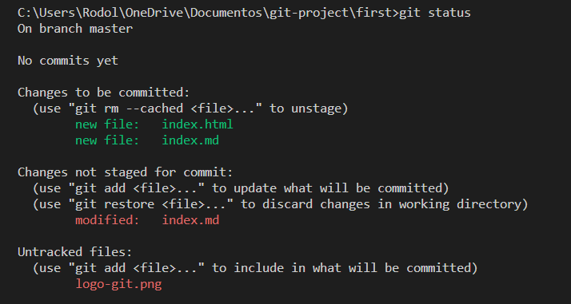
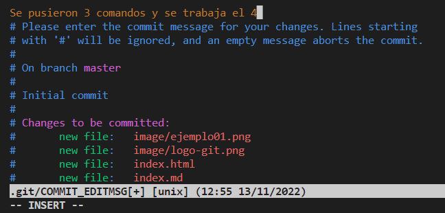

#  Comandos útiles de Git y GitHub

* Git **init**.

    Con este comando se inicia la sesión de git, se debe de iniciar por primera y única vez cuando no haz creado un directorio de **GIT**, una vez ejecutado se habrá cargado el **Working Directory** (directorio de trabajo), donde se creará una carpeta oculta llamada "*.git*" la cual llevará el control de los cambios del proyecto.

* Git **add**.

    Este comando tiene la función de subir los ficheros del **Working Directory** al **Staging Area** (área de ensayo).

* Git **status**.
    
    Con esta instrucción podremos ver el *estado* de los directorios guardados en el *Staging Area*, y los que aún se encuentran dentro del *Working Directory* sin guardar. A continuación, se mostrará un ejemplo, donde indicará en color verde los cambios que fueron guardados previamente con "git add", y con color rojo los cambios que aún no han sido guardados. 
    

* Git **commit**

    Aquí se añade para capturar los directorios y guardarlos en el **Repository**, una vez dada la orden se introducirá en el editor de texto, donde se digitará una pequeña descripción de los cambios hehos.
    