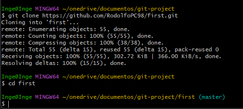

#  Comandos útiles de Git y GitHub

Se debe de tener como requisito previo una cuenta en *[GitHub](https://github.com/)* y tener instalado *[Git](https://git-scm.com/download/win)*, así como un editor de texto que le resulte más cómodo. Una vez cumplidos los requerimientos se configurará el nombre y el correo del usuario con los siguientes comandos:

    git config --global user.name "Juan Perez"
    git config --global user.email tuemail@ejemplo.com

Una vez configurado los datos del usuario a continuación se mostrarán los comandos básicos para utilizar en cualquier proyecto: 

* Git **init**.

    Con este comando se inicia la sesión de git, se debe de iniciar por primera y única vez cuando no haz creado un directorio de **GIT**, una vez ejecutado se habrá cargado el **Working Directory** (directorio de trabajo), donde se creará una carpeta oculta llamada "*.git*" la cual llevará el control de los cambios del proyecto.

* Git **add**.

    Este comando tiene la función de subir los ficheros del **Working Directory** al **Staging Area** (área de ensayo).

* Git **status**.
    
    Con esta instrucción podremos ver el *estado* de los directorios guardados en el *Staging Area*, y los que aún se encuentran dentro del *Working Directory* sin guardar. A continuación, se mostrará un ejemplo, donde indicará en color verde los cambios que fueron guardados previamente con "git add", y con color rojo los cambios que aún no han sido guardados.

    

* Git **commit**.

    Aquí se añade para capturar los directorios y guardarlos en el **Repository**, una vez dada la orden se introducirá en el editor de texto, donde se digitará una pequeña descripción de los cambios hehos.

    

    Para salir del editor de texto, basta con presionar la tecla "Esc" y escribir ":wq" para salir del editor y guardar los cambios.

    

    Para verificar que los cambios se guardaron correctamente debe aparecer algo como lo siguiente:

    

    Una manera más sencilla de guardar las capturas en el *repository* es agregando la siguiente linea de código:

        git commit -m "Escriba aquí su mensaje"
    
    Donde "-m" indica que se va a escribir un mensaje; Se muestra en la consola de la siguiente manera:

    

    Para guardar la captura de manera más rápida se digita la instrucción "-am" de la siguiente manera:

    

* Git **log**.
    
    Muestra el historial cronológico de confimación de un repositorio. Tal como se muestra en la imagen de abajo:
    
    

* Git **checkout**
    
    Es utilizado para  consultar o recuperar una línea existente dentro del *repository*. En el siguiente ejemplo se revertirá los cambios de un archivo en el cual se agrego un título al archivo "index.html".
    
    

    Aparentemente en la consola no pasa nada, pero recupera el archivo guardado en el repositorio. Incluso si es eliminado del *Working directory*.
    
* Git **Branch**.

    Si se digita este comando nos mostrará las ramas que existen dentro del proyecto.

    

    Si se desea agregar alguna nueva rama se debe realizar de la siguiente manera:

    

    Y ahora si volvemos a mostrar las ramas existentes, deberá aparecer la nueva versión que acabamos de crear.

    

    Nota: para cambiar de rama, se debe escribir el comando "git checkout" y a continuación el nombre de la rama a la que se desea cambiar.

* Git **remote**.

    Conecta un repositorio local con un repositorio remoto. En este caso se creará un nuevo repositorio en *GitHub* y se copiará lo seleccionado de la siguente captura.

    

    Se ejecuta en la consola.

    

    Y con ello, tendremos conectado nuestro repositorio a *GitHub*.

* Git **push**.

    Envía *commits* locales al repositorio remoto. Requiere dos parámetros: el repositorio remoto y la rama para la que es el push.

    

    Una vez ejecutado el comando nos mostrará un *login* para conectar el repositorio local a *GitHub*.

    

    Se usará el navegador predeterminado para iniciar la sesión, y se le concederá los permisos necesarios.

    

    Y se mostrará en la consola de la siguiente manera para corroborar que se guardo correctamente.

    

* Git **clone**.

    Crea una copia de trabajo local de un repositorio remoto existente, se usa git clone para copiar y descargar el repositorio a una computadora.
    En nuestra cuenta de *GitHub* se copiará el link del proyecto que deseamos clonar.

    

    Se escribe el comando "git clone" seguido de la dirección copiada.

    
    
    Podemos ver que efectivamente se clono, y ya se encuentra de nuevo en el equipo.